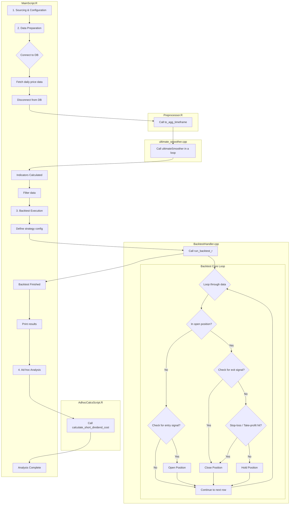

```mermaid
graph TD
    subgraph MainScript.R
        A[1. Sourcing & Configuration] --> B(2. Data Preparation);
        B --> C{Connect to DB};
        C --> D[Fetch daily price data];
        D --> E[Disconnect from DB];
    end

    subgraph Preprocessor.R
        F[Call to_agg_timeframe];
    end
    
    subgraph MainScript.R
        E --> F;
    end

    subgraph ultimate_smoother.cpp
        G[Call ultimateSmoother in a loop];
    end

    subgraph MainScript.R
        F --> G;
        G --> H[Indicators Calculated];
        H --> I[Filter data];
        I --> J[3. Backtest Execution];
        J --> K[Define strategy config];
    end

    subgraph BacktestHandler.cpp
        L[Call run_backtest_r];
        subgraph Backtest Core Loop
            M{Loop through data};
            M --> N{In open position?};
            N -- Yes --> O{Check for exit signal?};
            O -- Yes --> P[Close Position];
            O -- No --> Q{Stop-loss / Take-profit hit?};
            Q -- Yes --> P;
            Q -- No --> R[Hold Position];
            N -- No --> S{Check for entry signal?};
            S -- Yes --> T[Open Position];
            S -- No --> U[Continue to next row];
            T --> U;
            P --> U;
R --> U;
            U --> M;
        end
        L --> M;
    end
    
    subgraph MainScript.R
        K --> L;
        L --> V[Backtest Finished];
        V --> W[Print results];
        W --> X[4. Ad-hoc Analysis];
    end

    subgraph AdhocCalcsScript.R
        Y[Call calculate_short_dividend_cost];
    end

    subgraph MainScript.R
        X --> Y;
        Y --> Z[Analysis Complete];
    end
```
