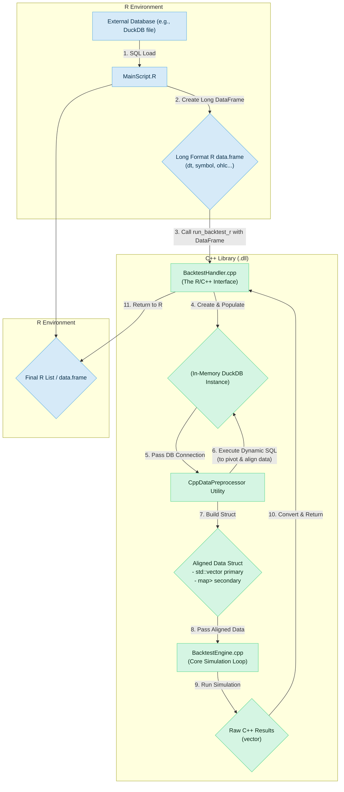

```mermaid
graph TD
    subgraph "R Environment"
        A["MainScript.R"]
        B["External Database (e.g., DuckDB file)"]
        C{"Long Format R data.frame<br/>(dt, symbol, ohlc...)"}

        B -- "1. SQL Load" --> A
        A -- "2. Create Long DataFrame" --> C
    end

    subgraph "C++ Library (.dll)"
        D["BacktestHandler.cpp<br/>(The R/C++ Interface)"]
        E{" (In-Memory DuckDB Instance)"}
        F["CppDataPreprocessor Utility"]
        G{"Aligned Data Struct<br/>- std::vector<OHLC> primary<br/>- map<string, vector<OHLC>> secondary"}
        H["BacktestEngine.cpp<br/>(Core Simulation Loop)"]
        I{"Raw C++ Results<br/>(vector<BarData>)"}

        D -- "4. Create & Populate" --> E
        E -- "5. Pass DB Connection" --> F
        F -- "6. Execute Dynamic SQL<br/>(to pivot & align data)" --> E
        F -- "7. Build Struct" --> G
        G -- "8. Pass Aligned Data" --> H
        C -- "3. Call run_backtest_r with DataFrame" --> D
        H -- "9. Run Simulation" --> I
    end

    subgraph "R Environment"
        J{"Final R List / data.frame"}
        I -- "10. Convert & Return" --> D
        D -- "11. Return to R" --> J
        A --> J
    end
    
    classDef R fill:#D6EAF8,stroke:#5DADE2,color:#052D49;
    classDef Cpp fill:#D5F5E3,stroke:#58D68D,color:#0A2A17;
    class A,B,C,J R
    class D,E,F,G,H,I Cpp
```